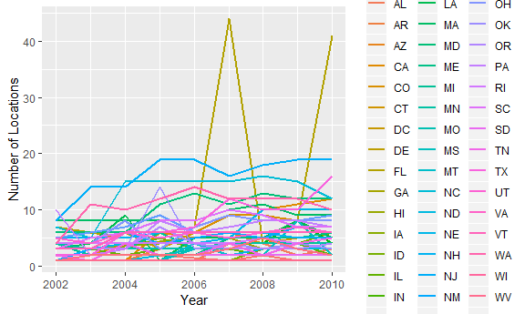
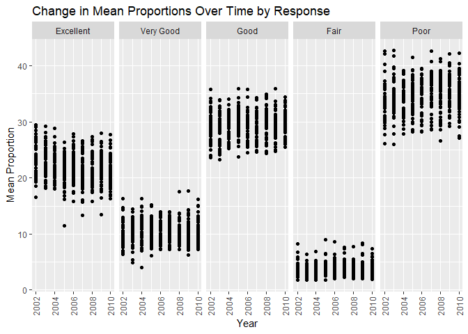
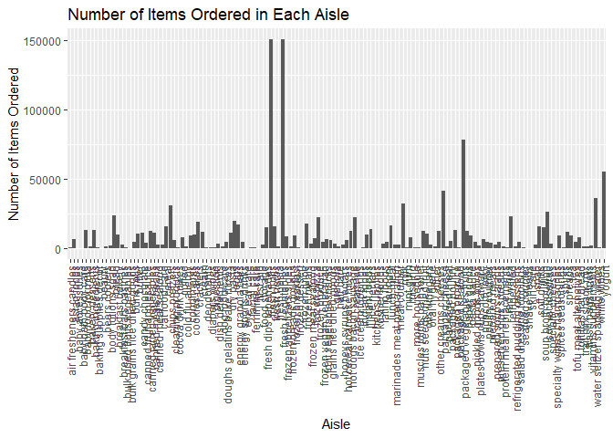

p8105\_hw3\_cj2493
================
Courtney Johnson
October 4, 2018

Problem 1
---------

Load BRFSS data from the p8105.datasets package and clean:

``` r
library(p8105.datasets)
data(brfss_smart2010) 
brfss_smart2010 = janitor::clean_names(brfss_smart2010) %>%
  filter(topic == "Overall Health") %>%
  select(-class, -topic, -question, -sample_size, -c(confidence_limit_low:geo_location)) %>%
  mutate(response = factor(response, labels = c("Excellent", "Very Good", "Good", "Fair", "Poor")))
```

Some problem solving using the data:

``` r
brfss_2002 = filter(brfss_smart2010, year == 2002) %>%
  distinct(locationdesc, .keep_all = TRUE) %>%
  count(locationabbr) %>%
  filter(n == 7) %>%
  mutate(state = abbr2state(locationabbr)) %>%
  select(-locationabbr)
```

In 2002, the states that had 7 locations represented were the following: Connecticut, Florida, North Carolina.

Make a "spaghetti plot" that shows the number of locations in each state from 2002 to 2010:

``` r
brfss_spaghetti = brfss_smart2010 %>%
  group_by(year, locationabbr) %>%
  summarize(n_locations = n_distinct(locationdesc)) %>%
  ggplot(aes(x = year, y = n_locations, color = locationabbr)) + 
  labs(x = "Year", y = "Number of Locations", color = "State") +
  geom_line(size = 1) +
  theme(legend.position = "right")
brfss_spaghetti
```



Make a table showing, for the years 2002, 2006, and 2010, the mean and standard deviation of the proportion of "Excellent" responses across locations in NY state.

``` r
brfss_table_data = filter(brfss_smart2010, year == 2002 | year == 2006 | year == 2010) %>%
  filter(locationabbr == "NY") %>%
  filter(response == "Excellent") %>%
  group_by(year) %>%
  summarize(mean_excellent = mean(data_value),
         sd_excellent = sd(data_value)) %>%
  knitr::kable()

brfss_table_data
```

|  year|  mean\_excellent|  sd\_excellent|
|-----:|----------------:|--------------:|
|  2002|         24.04000|       4.486424|
|  2006|         22.53333|       4.000833|
|  2010|         22.70000|       3.567212|

For each year and state, compute the average proportion in each response category (taking the average across locations in a state). Make a five panel plot that shows, for each response category separately, the distribution of these state level averages over time.

``` r
brfss_plot = brfss_smart2010 %>%
  group_by(year, locationabbr, response) %>%
  summarize(mean_prop = mean(data_value)) %>%
  ggplot(aes(x = year, y = mean_prop)) + 
  geom_point() + 
  facet_grid(~response) +
  labs(x = "Year", y = "Mean Proportion", title = "Change in Mean Proportions Over Time by Response") +
  theme(axis.text.x = element_text(angle = 90, hjust = 1, vjust = 0.5))

brfss_plot
```

    ## Warning: Removed 21 rows containing missing values (geom_point).



Problem 2
---------

Load the instacart data from the p8105.datasets package:

``` r
data(instacart) 
instacart = janitor::clean_names(instacart)
```

Write a description of the dataset:

The instacart data has 1384617 observations of 15 variables. Some of the variables include product name, the product id, the order in which it was added to the cart, what hour it was added, the id of its department, and number of days since the last time it was ordered. For example, here is a chunk of the dataset:

``` r
head(instacart)
```

    ## # A tibble: 6 x 15
    ##   order_id product_id add_to_cart_ord~ reordered user_id eval_set
    ##      <int>      <int>            <int>     <int>   <int> <chr>   
    ## 1        1      49302                1         1  112108 train   
    ## 2        1      11109                2         1  112108 train   
    ## 3        1      10246                3         0  112108 train   
    ## 4        1      49683                4         0  112108 train   
    ## 5        1      43633                5         1  112108 train   
    ## 6        1      13176                6         0  112108 train   
    ## # ... with 9 more variables: order_number <int>, order_dow <int>,
    ## #   order_hour_of_day <int>, days_since_prior_order <int>,
    ## #   product_name <chr>, aisle_id <int>, department_id <int>, aisle <chr>,
    ## #   department <chr>

In the first row, the item is Bulgarian yogurt, was part of order 1, had id 49302, was the first item added to the cart, was ordered 9 days prior, and was located in aisle 120. There are 134 aisles, and the most items are ordered from aisle 83.

Make a plot that shows the number of items ordered in each aisle. Order aisles sensibly, and organize your plot so others can read it.

``` r
instacart_num_items = instacart %>%
  group_by(aisle) %>%
  summarize(items_ordered = n()) %>%
  ggplot(aes(x = aisle, y = items_ordered)) +
  geom_bar(stat = "identity") +
  labs(x = "Aisle", y = "Number of Items Ordered", title = "Number of Items Ordered in Each Aisle") +
  theme(axis.text.x = element_text(angle = 90, hjust = 1, vjust = 0.5))


instacart_num_items
```



Make a table showing the most popular item in each of the aisles "baking ingredients", "dog food care", and "packaged vegatables fruits".

``` r
pop_aisles = filter(instacart, aisle == "baking ingredients" | aisle == "dog food care" | aisle == "packaged vegetables fruits") %>%
  group_by(aisle, product_name) %>%
  summarize(product_count = n()) %>%
  filter(product_count == max(product_count)) %>%
  knitr::kable()
pop_aisles
```

| aisle                      | product\_name                                 |  product\_count|
|:---------------------------|:----------------------------------------------|---------------:|
| baking ingredients         | Light Brown Sugar                             |             499|
| dog food care              | Snack Sticks Chicken & Rice Recipe Dog Treats |              30|
| packaged vegetables fruits | Organic Baby Spinach                          |            9784|

Make a table showing the mean hour of the day at which pink lady apples and coffee ice cream are ordered on each day of the week.

``` r
instacart %>%
  filter(product_name == "Pink Lady Apple" | product_name == "Coffee Ice Cream") %>%
  group_by(product_name, order_dow) %>%
  summarize(mean_hour = mean(order_hour_of_day)) %>%
  spread(key = order_dow, value = mean_hour) %>%
  knitr::kable()
```

| product\_name    |         0|         1|         2|         3|         4|         5|         6|
|:-----------------|---------:|---------:|---------:|---------:|---------:|---------:|---------:|
| Coffee Ice Cream |  13.77419|  14.31579|  15.38095|  15.31818|  15.21739|  12.26316|  13.83333|
| Pink Lady Apple  |  14.40000|  14.20000|  13.20000|   8.00000|  11.00000|  16.00000|  13.00000|

Problem 3
---------
