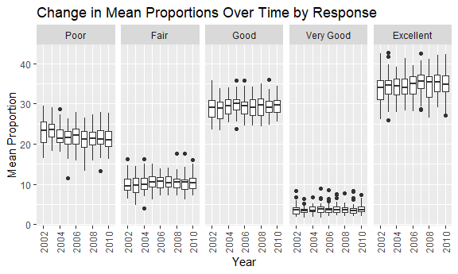
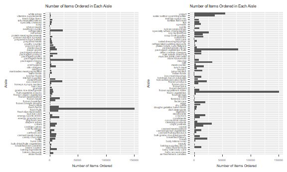
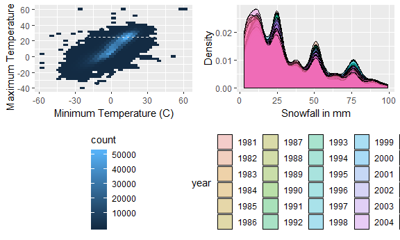

p8105\_hw3\_cj2493
================
Courtney Johnson
October 4, 2018

Problem 1
---------

Load BRFSS data from the p8105.datasets package and clean:

``` r
data(brfss_smart2010) 
brfss_smart2010 = janitor::clean_names(brfss_smart2010) %>%
  filter(topic == "Overall Health") %>%
  select(-class, -topic, -question, -sample_size, -c(confidence_limit_low:geo_location)) %>%
  mutate(response = factor(response, labels = c("Poor", "Fair", "Good", "Very Good", "Excellent")))
```

Some problem solving using the data:

``` r
brfss_2002 = filter(brfss_smart2010, year == 2002) %>%
  distinct(locationdesc, .keep_all = TRUE) %>%
  count(locationabbr) %>%
  filter(n == 7) %>%
  mutate(state = abbr2state(locationabbr)) %>%
  select(-locationabbr)
```

In 2002, the states that had 7 locations represented were the following: Connecticut, Florida, North Carolina.

Make a "spaghetti plot" that shows the number of locations in each state from 2002 to 2010:

``` r
brfss_spaghetti = brfss_smart2010 %>%
  group_by(year, locationabbr) %>%
  summarize(n_locations = n_distinct(locationdesc)) %>%
  ggplot(aes(x = year, y = n_locations, color = locationabbr)) + 
  labs(x = "Year", y = "Number of Locations", color = "State") +
  geom_line(size = 1) +
  theme(legend.position = "right")
brfss_spaghetti
```


This is not a very helpful plot because we can see that there is a state with a very high outlier, but we cannot tell which state it is; the colors are difficult to distinguish between.

Make a table showing, for the years 2002, 2006, and 2010, the mean and standard deviation of the proportion of "Excellent" responses across locations in NY state:

``` r
brfss_table_data = filter(brfss_smart2010, year == 2002 | year == 2006 | year == 2010) %>%
  filter(locationabbr == "NY") %>%
  filter(response == "Excellent") %>%
  group_by(year) %>%
  summarize(mean_excellent = mean(data_value),
         sd_excellent = sd(data_value)) %>%
  knitr::kable()

brfss_table_data
```

|  year|  mean\_excellent|  sd\_excellent|
|-----:|----------------:|--------------:|
|  2002|         30.64000|       5.099804|
|  2006|         31.28333|       4.370545|
|  2010|         34.13333|       5.250952|

This table tells us that the mean and standard deviation of proportions of excellent responses are similar across the years we looked at.

For each year and state, compute the average proportion in each response category (taking the average across locations in a state). Make a five panel plot that shows, for each response category separately, the distribution of these state level averages over time:

``` r
brfss_plot = brfss_smart2010 %>%
  group_by(year, locationabbr, response) %>%
  summarize(mean_prop = mean(data_value)) %>%
  ggplot(aes(x = year, y = mean_prop, group = year)) + 
  geom_boxplot() + 
  facet_grid(~response) +
  labs(x = "Year", y = "Mean Proportion", title = "Change in Mean Proportions Over Time by Response") +
  theme(axis.text.x = element_text(angle = 90, hjust = 1, vjust = 0.5))

brfss_plot
```

    ## Warning: Removed 21 rows containing non-finite values (stat_boxplot).



This five panel plot gives us good reason to think that the proportions of responses are similar across years, but different among the level of response.

Problem 2
---------

Load the instacart data from the p8105.datasets package:

``` r
data(instacart) 
instacart = janitor::clean_names(instacart)
```

Write a description of the dataset:

The instacart data has 1384617 observations of 15 variables. Some of the variables include product name, the product id, the order in which it was added to the cart, what hour it was added, the id of its department, and number of days since the last time it was ordered. For example, here is a chunk of the dataset:

``` r
head(instacart)
```

    ## # A tibble: 6 x 15
    ##   order_id product_id add_to_cart_ord~ reordered user_id eval_set
    ##      <int>      <int>            <int>     <int>   <int> <chr>   
    ## 1        1      49302                1         1  112108 train   
    ## 2        1      11109                2         1  112108 train   
    ## 3        1      10246                3         0  112108 train   
    ## 4        1      49683                4         0  112108 train   
    ## 5        1      43633                5         1  112108 train   
    ## 6        1      13176                6         0  112108 train   
    ## # ... with 9 more variables: order_number <int>, order_dow <int>,
    ## #   order_hour_of_day <int>, days_since_prior_order <int>,
    ## #   product_name <chr>, aisle_id <int>, department_id <int>, aisle <chr>,
    ## #   department <chr>

In the first row, the item is Bulgarian yogurt, was part of order 1, had id 49302, was the first item added to the cart, was ordered 9 days prior, and was located in aisle 120. There are 134 aisles, and the most items are ordered from aisle 83.

Make a plot that shows the number of items ordered in each aisle. Order aisles sensibly, and organize your plot so others can read it:

``` r
instacart_num_items_1 = instacart %>%
  filter(aisle_id >= 1 & aisle_id <= 67) %>%
  group_by(aisle) %>%
  summarize(items_ordered = n()) %>%
  ggplot(aes(x = aisle, y = items_ordered)) +
  geom_bar(stat = "identity") +
  labs(x = "Aisle", y = "Number of Items Ordered", title = "Number of Items Ordered in Each Aisle", cex = 0.5) +
  theme(text = element_text(size = 5)) +
  coord_flip()

instacart_num_items_2 = instacart %>%
  filter(aisle_id > 67) %>%
  group_by(aisle) %>%
  summarize(items_ordered = n()) %>%
  ggplot(aes(x = aisle, y = items_ordered)) +
  geom_bar(stat = "identity") +
  labs(x = "Aisle", y = "Number of Items Ordered", title = "Number of Items Ordered in Each Aisle") +
  theme(text = element_text(size = 5)) +
  coord_flip()

instacart_num_items_1 + instacart_num_items_2
```



This plot is naturally difficult to read because there are so many aisles. Splitting the plot into two helps, but it is still a lot of data to look at. What we can tell is there are a few aisles that are much more popular than the rest: fresh fruits, fresh vegetables, and packed vegetables & fruits.

Make a table showing the most popular item in each of the aisles "baking ingredients", "dog food care", and "packaged vegatables fruits":

``` r
pop_aisles = filter(instacart, aisle == "baking ingredients" | aisle == "dog food care" | aisle == "packaged vegetables fruits") %>%
  group_by(aisle, product_name) %>%
  summarize(product_count = n()) %>%
  filter(product_count == max(product_count)) %>%
  knitr::kable()
pop_aisles
```

| aisle                      | product\_name                                 |  product\_count|
|:---------------------------|:----------------------------------------------|---------------:|
| baking ingredients         | Light Brown Sugar                             |             499|
| dog food care              | Snack Sticks Chicken & Rice Recipe Dog Treats |              30|
| packaged vegetables fruits | Organic Baby Spinach                          |            9784|

From this table, we can see that across aisles there are large differences in how many items are bought in each aisle. It tells us that although they are all the most popular item in their respective aisle, the amount purchased varies. For example, the packaged vegetables and fruits aisle is more visited than the other two.

Make a table showing the mean hour of the day at which pink lady apples and coffee ice cream are ordered on each day of the week:

``` r
mean_hour = instacart %>%
  filter(product_name == "Pink Lady Apple" | product_name == "Coffee Ice Cream") %>%
  group_by(product_name, order_dow) %>%
  summarize(mean_hour = mean(order_hour_of_day)) %>%
  mutate(order_dow = c("Sunday", "Monday", "Tuesday", "Wednesday", "Thursday", "Friday", "Saturday")) %>%
  spread(key = order_dow, value = mean_hour) %>%
  select(product_name, Sunday, Monday, Tuesday, Wednesday, Thursday, Friday, Saturday) %>%
  knitr::kable()

mean_hour
```

| product\_name    |    Sunday|    Monday|   Tuesday|  Wednesday|  Thursday|    Friday|  Saturday|
|:-----------------|---------:|---------:|---------:|----------:|---------:|---------:|---------:|
| Coffee Ice Cream |  13.77419|  14.31579|  15.38095|   15.31818|  15.21739|  12.26316|  13.83333|
| Pink Lady Apple  |  14.40000|  14.20000|  13.20000|    8.00000|  11.00000|  16.00000|  13.00000|

For this table, I assumed that 0 was Sunday and 7 was Saturday. I also assumed that the time is in terms of hours past midnight. The information in this table tells us that for both of these items, they are typically bought in the afternoon between noon and 4 pm. The exception to this is that pink lady apples tend to be bought in the morning between 8 and 11 am on Wednesdays and Thursdays.

Problem 3
---------

Load the ny\_noaa data from the p8105.datasets package:

``` r
data(ny_noaa)
ny_noaa = janitor::clean_names(ny_noaa)
```

Describe the data:

The ny\_noaa dataset containes 2595176 observations of 7 variables. Some of the variables include weather station, the date, precipitation in tenths of mm, snowfall in mm, snow depth in mm, maximum temperature in tenths of degrees Celsius, and minimum temperature in tenths of degrees Celsius. So, we must convert the variables into common measurement; this means converting precipitation into mm and maximum and minimum temperature into degrees Celsius. Unfortunately, the set contains a lot of missing data.

Clean the data:

``` r
tidy_ny_noaa = separate(ny_noaa, date, into = c("year", "month", "day"), sep = "-") %>%
  mutate(year = as.numeric(year), 
         month = as.numeric(month), 
         day = as.numeric(day), 
         tmax = as.numeric(tmax)/10, 
         tmin = as.numeric(tmin)/10,
         prcp = prcp/10
         )
```

Make a two-panel plot showing the average max temperature in January and in July in each station across years:

``` r
jan_jul_ny_noaa = filter(tidy_ny_noaa, month == 1 | month == 7) %>%
  mutate(month = month.name[month]) %>%
  group_by(year, month, id) %>%
  summarize(mean_tmax = mean(tmax, na.rm = TRUE)) %>%
  ggplot(aes(x = year, y = mean_tmax)) +
  geom_point() + 
  theme(axis.text.x = element_text(angle = 90, hjust = 1, vjust = 0.5)) +
  labs(x = "Year", y = "Mean Maximum Temperature, in Celsius", title = "Change in Temperature in New York for Each Station") + 
  facet_grid(~month) 

jan_jul_ny_noaa
```

    ## Warning: Removed 5970 rows containing missing values (geom_point).


This tells us that the temperatures vary greatly between January and July, which intuitively makes sense. We also see that there is some variation across years, but not too much.

Make a two panel plot (i) showing tmax vs tmin for the full dataset, and (ii) showing the distribution of snowfall values greater than 0 and less than 100 separately by year

``` r
tmax_vs_tmin = tidy_ny_noaa %>%
  ggplot(aes(x = tmin, y = tmax)) +
  geom_hex() +
  theme(legend.position = "bottom", legend.direction = "vertical") +
  labs(x = "Minimum Temperature (C)", y = "Maximum Temperature (C)")

snow_dist = filter(tidy_ny_noaa, snow > 0 & snow < 100) %>%
  mutate(year = as.character(year)) %>%
  group_by(year) %>%
  ggplot(aes(x = snow, fill = year)) +
  geom_density(alpha = .3)  +
  theme(legend.position = "bottom") +
  labs(x = "Snowfall in mm", y = "Density")

tmax_vs_tmin + snow_dist
```

    ## Warning: Removed 1136276 rows containing non-finite values (stat_binhex).



From the plot of tmax and tmin, we can see that minimum temperature is positively correlated with maximum temperature, which intuitively makes sense. We can also guess that there are some incorrectly recorded temperatures, because 60 degrees Celsius is 140 degrees Farenheit, which is highly unlikey.

From the plot of snowfall distribution, we can see that there are peaks that correspond to 1/2 inch, 1 inch, 2 inches, and 3 inches. This implies that when snowfall is recorded, it is often rounded to a whole number. This plot is also problematic because it's difficult to look at the differences between years. Similar to the spaghetti plot, there are too many years to easily differentiate. We can only roughly see where they're similar.
